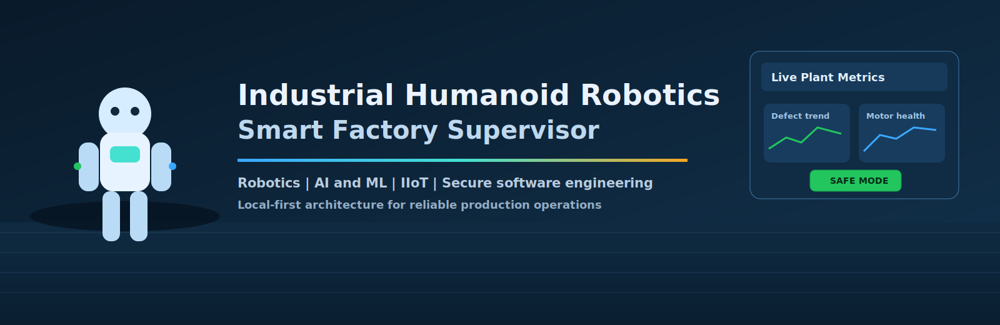
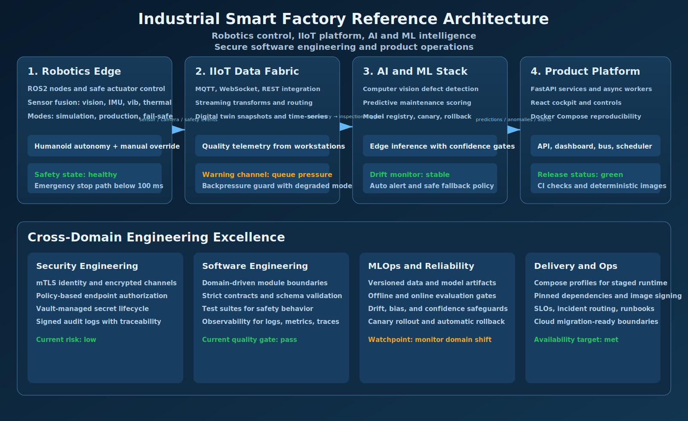
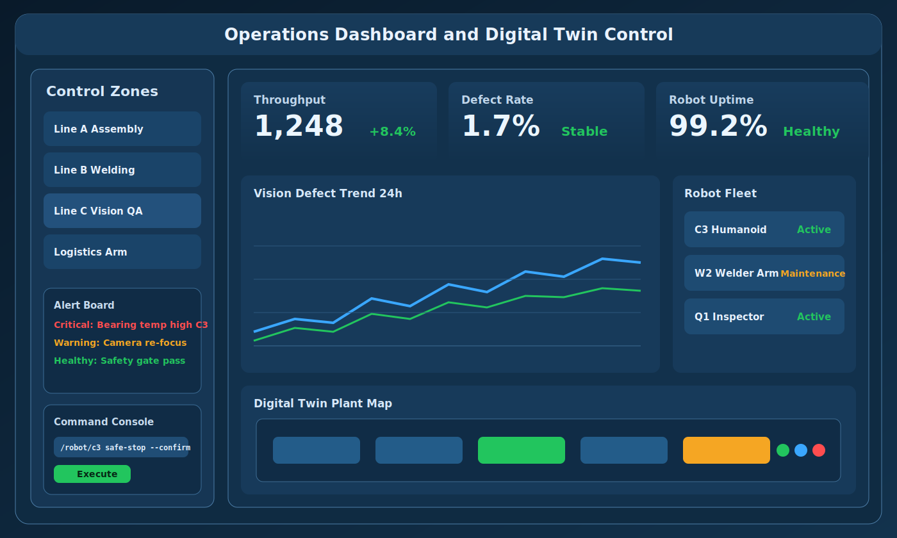
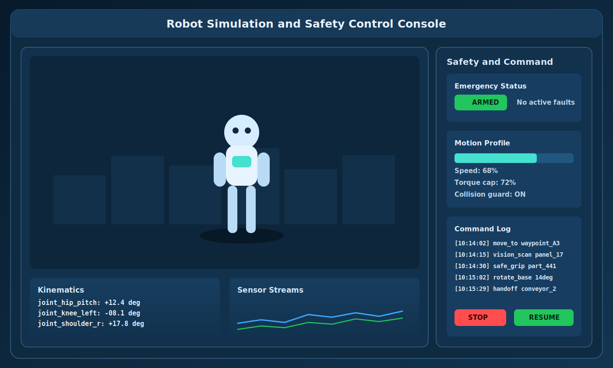
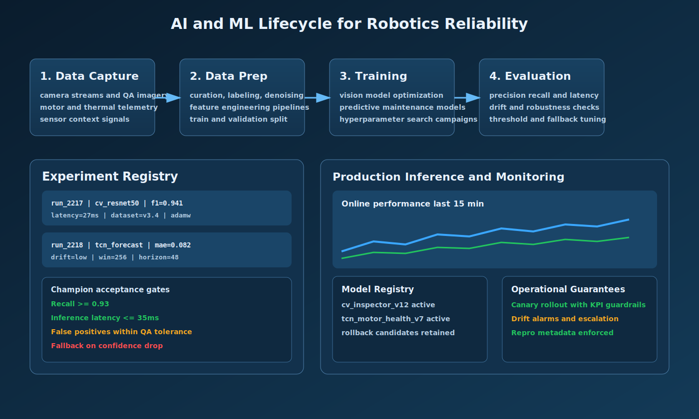
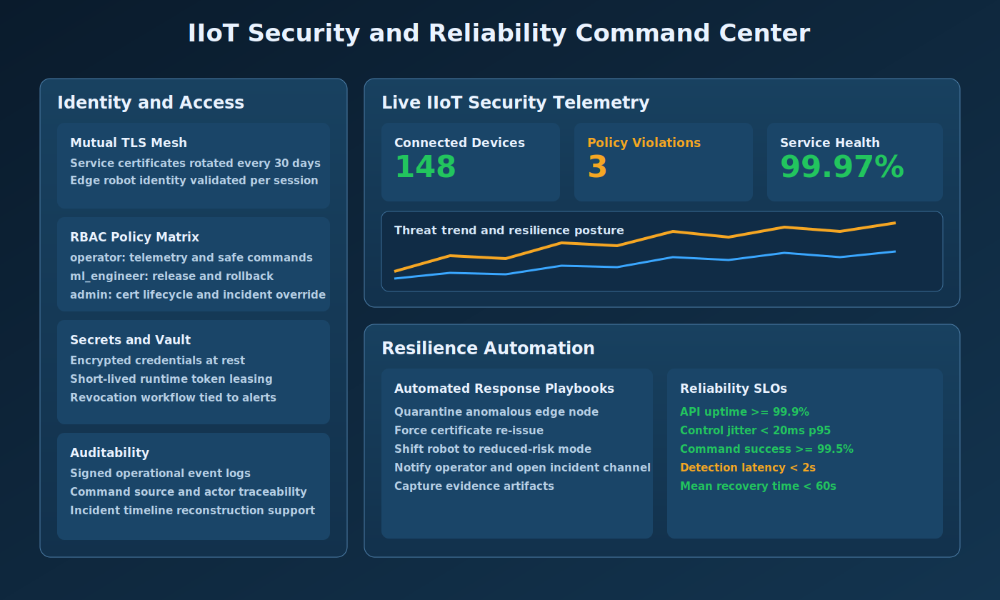

# Industrial Humanoid Robotics Smart Factory Supervisor



> End-to-end local-first showcase: robotics + edge IIoT + AI/ML + Docker
> deployment + security.

This repository is designed as a portfolio-grade systems showcase that
demonstrates practical execution across:

- Robotics simulation and safe motion orchestration
- AI/ML training, evaluation, and production inference operations
- IIoT telemetry ingestion, command/control, and digital twin patterns
- Production-focused software engineering and secure-by-default architecture

## 1. Problem Statement

Manufacturing facilities need automated inspection, predictive maintenance, and
safe humanoid robotic actions while preserving dev agility and security. This
project validates a real local workflow where the entire solution runs on
a single machine via Docker.

Goals:
Autonomous visual defect detection on assembly parts.
Predictive failure forecasting from sensor telemetry.
Real-time edge control with safe stop and manual override.
Local secure communication across services (TLS + identity).
Self-contained Docker deployment with optional cloud migration path.

## 2. Delivery Scope

Local: Docker Compose stack
Edge simulation: ROS2 + Gazebo (or lightweight Python movement emulation)
ML: PyTorch model for visual inspection + time-series fault detection
Backend: FastAPI for telemetry, command, and digital twin state
Frontend: React dashboard with live telemetry and command widgets
Security: TLS, RBAC mode, secret files + vault simulation

## 3. Architecture Visuals

### Main architecture



### Local workflows



### Robot edge simulation



### AI/ML lifecycle and reliability operations



### IIoT security and resilience command center



## 4. Service interactions

Events flow through Redis Streams. Each service owns one stream
and writes to it via `XADD`. Downstream services consume via
`XREADGROUP` with persistent cursors for at-least-once delivery.
A `trace_id` propagates across services via transport envelope
(HTTP header `X-Trace-Id` or stream field).

```
core-platform                produces sensor, camera, safety, humanoid events
   │
   │ XADD events:core-platform
   │
   ▼
ai-service                   consumes events, runs inference, emits predictions
   │
   │ XADD events:ai-service
   │
   ▼
ops-api                      consumes events, serves REST endpoints
   │                                │
   │ XADD events:ops-api            │ HTTP /api/*
   ▼                                ▼
redis streams                  ops-frontend (React, reads ops-api)
```

| Service | Emits (`type` prefix) | Consumes |
|---|---|---|---|
| `core-platform` | `sensor.*`, `camera.*`, `safety.*` | — (produces only) |
| `ai-service` | `ml.*` | `events:core-platform` |
| `ops-api` | `api.*` | `events:core-platform`, `events:ai-service` |
| `ai-agent` | — | HTTP from `ops-api` (readonly, no stream access) |
| `ops-frontend` | — | HTTP + WebSocket from `ops-api` (no direct stream access) |

## 5. Project structure

```
AGENTS.md              — AI agent entry point
DEVELOPER.md           — human developer guide
.agent/                — AI agent conventions and rules
read-me/               — docs, SVGs, architecture diagrams
secrets/               — local dev secrets (gitignored)
scripts/               — tooling (doc generation, etc.)
src/
├── docker-compose.yaml
├── .env / .env.template
├── envs/<service>/    — per-service env overrides
├── core-platform/     — C++20 simulation (fully implemented)
├── ai-service/        — Python ML inference service
├── ops-api/           — FastAPI backend (REST + WebSocket)
├── ai-agent/          — AI chat agent (FastAPI, mock LLM)
├── ops-frontend/      — React dashboard (Vite + TypeScript)
└── shared/            — cross-service schemas and utilities
data/                  — runtime output (gitignored)
logs/                  — runtime output (gitignored)
```

## 6. Local setup (no cloud provider required)

### Pre-reqs
Docker Desktop (or Docker Engine + Compose plugin)
Python 3.11 (recommended for local scripts)
Node.js 18+

### Start stack

From the project root directory, run:

```bash
docker compose -f src/docker-compose.yaml build
docker compose -f src/docker-compose.yaml up -d
```

### Open UI

API: http://localhost:8003/docs
Dashboard: http://localhost:3000
AI Agent: http://localhost:8004/docs

### CLI and robot sim

```bash
cd src/core-platform
python scripts/publish_to_redis.py
```

## 7. Validation checks

`curl http://localhost:8003/health` (API health)
`curl http://localhost:8003/api/v1/robot/status` (edge status)
`curl http://localhost:8004/health` (AI agent health)

## 8. Security stance

Hardcoded demo credentials (admin/admin) on the login page — not for production.
No TLS, RBAC, or vault implemented in this showcase.

## 9. Visual and diagram sources

Artifacts are stored under `ReadMe/assets/` as editable SVG so visuals can
evolve with implementation. Current assets:
`banner.svg` - Hero banner framing the project narrative
`diagram-architecture.svg` - Full system architecture and
  cross-cutting engineering layers
`screen-dashboard.svg` - Operator UI for live monitoring and
  commands
`screen-robot-sim.svg` - Robot simulation console with safety
  controls
`screen-ml-pipeline.svg` - AI/ML lifecycle, model governance,
  and inference monitoring
`screen-security-iiot.svg` - IIoT security telemetry, access
  control, and resilience automation

## 10. Future cloud migration (optional)

Replace local MQTT broker with Azure IoT Hub / AWS IoT Core.
Migrate backend to Kubernetes + managed DB.
Add MLFlow with model registry and CI retraining pipeline.

## 11. Own this architecture

Start from `src/docker-compose.yaml`.
Extend the C++ simulation in `src/core-platform/cpp/`.
Train models and wire to the ai-service inference endpoints.
